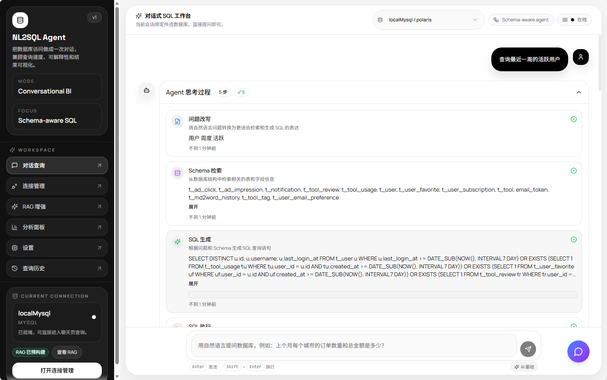
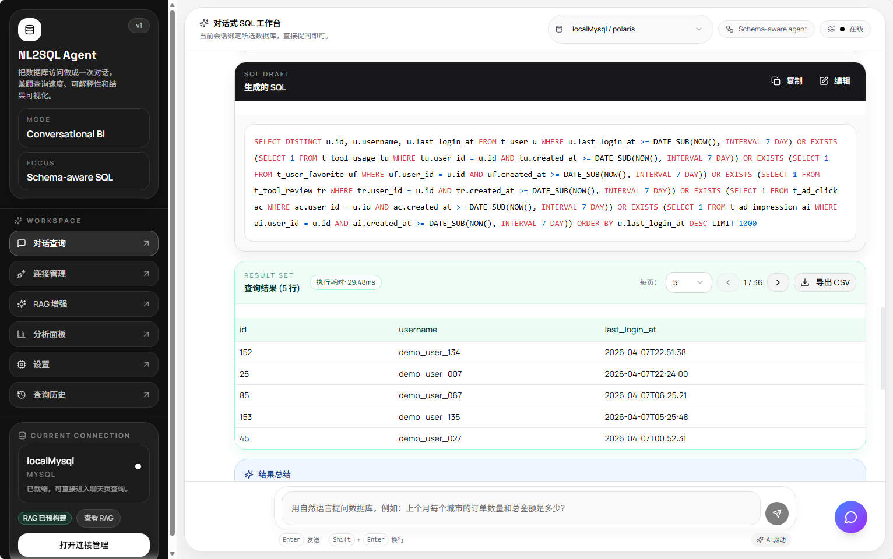
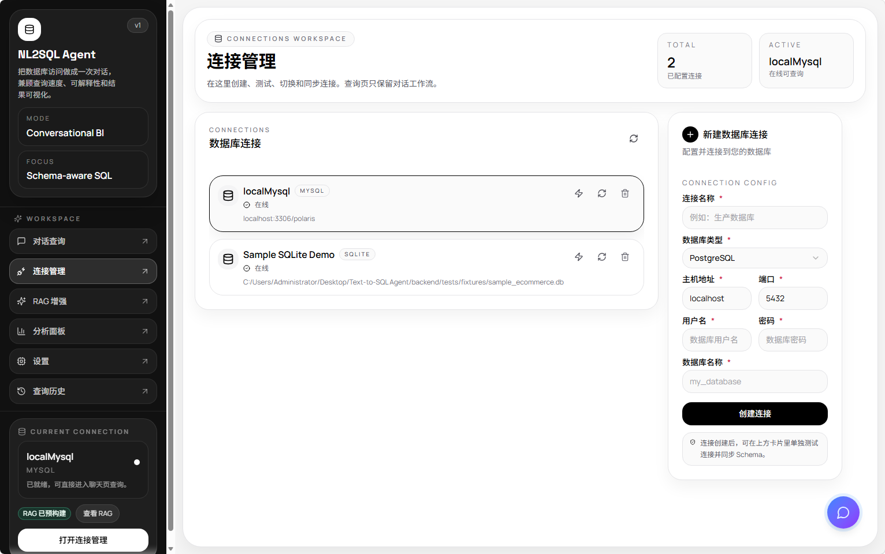
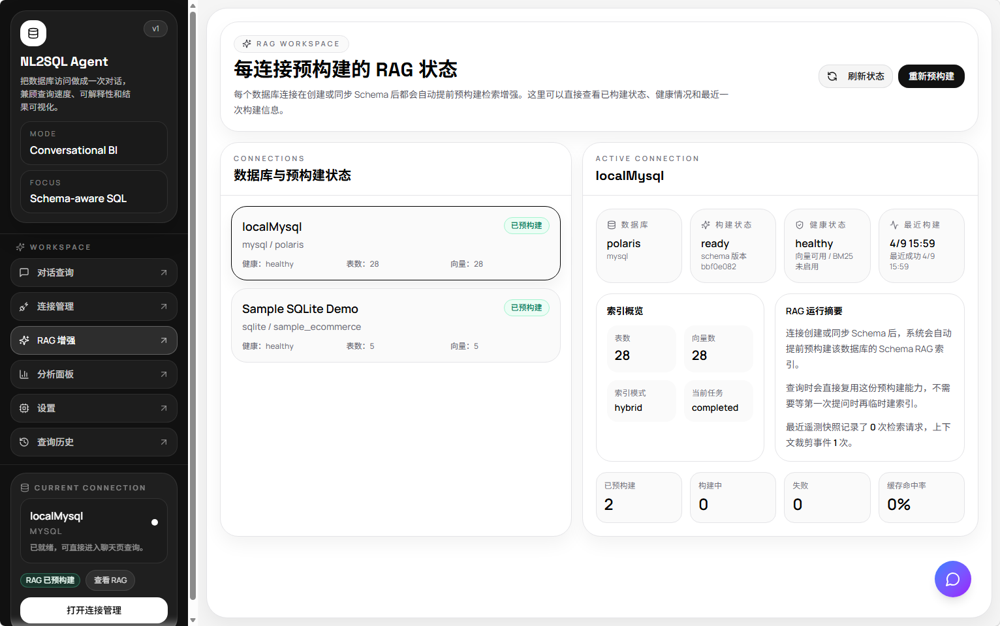
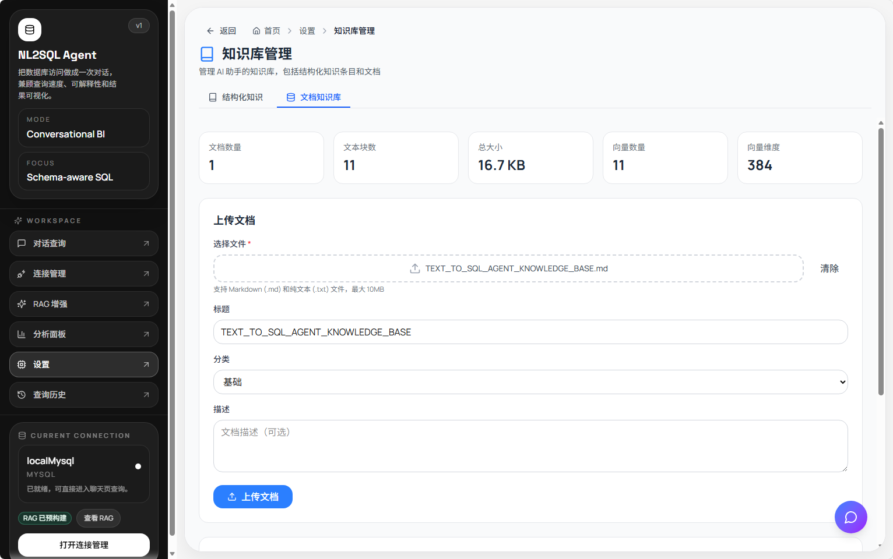
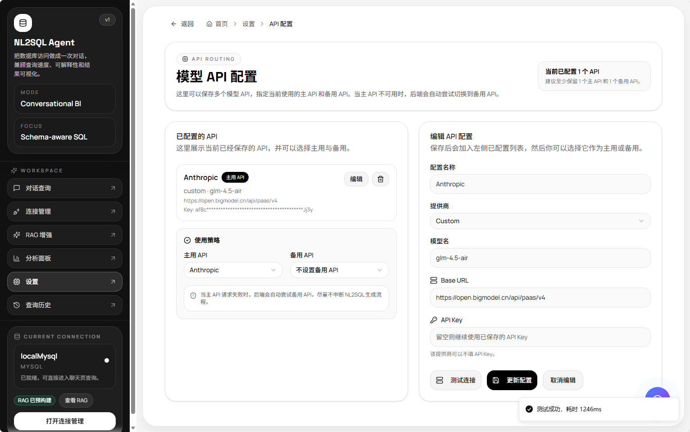

# NL2SQL Agent

一个面向真实业务场景的 AI Agent 项目：将自然语言问题转换为 SQL，结合 Schema RAG、文档知识库、流式交互和可观测性能力，构建一套可运行、可部署、可演示的智能数据分析系统。

这个项目不是“问一句返回一段 SQL”的玩具 Demo，而是一套完整的 AI 应用工程作品，适合用于展示我在 `AI Agent`、`LLM 应用工程`、`RAG`、`全栈产品化` 方向的实际能力。

## 项目亮点

- 自然语言转 SQL，覆盖问题改写、Schema 检索、SQL 生成、执行、总结输出完整链路
- 支持 `MySQL`、`PostgreSQL`、`SQLite` 多数据库连接管理
- 内置 `Schema RAG`，在生成 SQL 之前先检索相关表、字段和关系线索
- 内置 `Document RAG`，支持上传 Markdown / TXT 文档作为 AI 助手知识库
- 提供独立 AI 助手悬浮窗，支持流式输出、拖拽、最小化
- 提供模型连接测试、Prompt 配置、查询历史、分析面板、RAG 状态管理等完整后台能力

## 为什么这个项目适合面试 AI Agent 开发岗

AI Agent 开发岗通常不会只看“会不会调模型接口”，而是会看是否具备从工作流设计到产品落地的完整能力。这个项目对应的能力点比较完整。

### 1. Agent 工作流设计能力

系统实现的是多阶段 NL2SQL Agent 流程，而不是一次性 Prompt 调用：

1. 用户输入自然语言问题
2. 问题改写与意图整理
3. Schema RAG 检索相关表和字段
4. 组装上下文与 Prompt
5. 生成 SQL
6. 执行 SQL
7. 输出结果、摘要、图表建议
8. 记录历史和遥测信息

这能体现：

- 多步骤 Agent 设计能力
- 检索与生成分离
- 失败可追踪、结果可解释
- 面向真实业务的链路编排能力

### 2. RAG 系统工程能力

项目里不是只有一类检索，而是两套：

- `Schema RAG`：服务于 SQL 生成，检索数据库表结构和关系线索
- `Document RAG`：服务于 AI 助手，检索上传的产品文档或说明文档

这能体现：

- 检索增强生成的工程落地能力
- 结构化知识与非结构化知识的分层设计
- 向量检索、文档切块、索引构建和查询命中能力

### 3. LLM 接入与配置能力

系统支持独立模型配置与连接测试，覆盖：

- 提供商切换
- 自定义 Base URL
- 模型名配置
- API Key 管理
- 模型连接测试

这能体现：

- 多模型接入能力
- OpenAI 兼容协议接入经验
- 配置与运行时逻辑分离
- 面向产品可配置化设计

### 4. 流式交互与前端工程能力

项目支持：

- 查询链路流式输出
- 悬浮 AI 助手流式输出
- 悬浮窗拖拽
- 最小化为悬浮球
- 配置页与管理页联动

这能体现：

- SSE / 流式响应前端处理能力
- AI 应用交互设计能力
- 复杂状态管理与 UI 联动能力

### 5. 后端服务与产品化能力

后端不是脚本，而是结构化 API 服务，包含：

- 连接管理
- 查询执行
- Prompt 管理
- 文档上传与检索
- 历史记录与分析统计
- RAG 索引状态与健康信息
- AI 助手配置与连接测试

这能体现：

- FastAPI 工程化能力
- 模块化服务拆分能力
- 真实产品后端的设计与交付能力

## 核心功能

### 自然语言转 SQL

- 输入中文或英文问题
- 自动问题改写
- 结合 Schema RAG 选择相关表
- 生成 SQL 并执行
- 返回查询结果、摘要和图表建议

### 连接管理

- 支持多数据库类型
- 新增、删除、测试连接
- 同步 Schema 缓存
- 管理在线状态

### Schema RAG

- 预构建数据库 Schema 索引
- 展示索引状态、表数、向量数、健康状态
- 查询前自动提供相关上下文

### 文档知识库

- 上传 Markdown / TXT 文件
- 文档切块与向量化
- 文档搜索
- 为 AI 助手提供知识支撑

### 悬浮 AI 助手

- 页面右下角悬浮入口
- 展开聊天
- 流式回答
- 可拖动
- 最小化回悬浮球

### 系统配置与观测

- 模型 API 配置
- AI 助手单独配置
- Prompt 模板配置
- 查询历史
- 分析面板
- RAG 遥测和状态页

## 产品预览

### 对话式 SQL 工作台


### SQL 生成与结果展示



### 数据库连接管理



### RAG 状态管理



### 文档知识库



### 模型 API 配置与连接测试



## 技术架构

### 前端

- React 18
- TypeScript
- Vite
- Tailwind CSS
- Zustand
- Axios

职责：

- 提供对话查询和管理后台界面
- 处理流式响应
- 管理连接、RAG、知识库、AI 助手等状态

### 后端

- FastAPI
- Pydantic
- SQLAlchemy
- SQLite 元数据库
- Chroma 向量存储

职责：

- 连接数据库并执行 SQL
- 管理 NL2SQL Agent 链路
- 负责 RAG 检索、文档索引和配置管理
- 对外提供统一 API

### AI / 检索层

- OpenAI 兼容模型接入
- Anthropic / Custom Provider 兼容思路
- Schema RAG
- Document RAG
- Prompt 模板系统

## 仓库结构

```text
.
├─ app/                                   # FastAPI 主应用
│  ├─ agent/                              # NL2SQL Agent 工作流
│  ├─ api/                                # HTTP API
│  ├─ core/                               # 配置、依赖注入、应用装配
│  ├─ db/                                 # 数据库连接器与元数据层
│  ├─ llm/                                # 模型客户端
│  ├─ prompts/                            # Prompt 模板
│  ├─ rag/                                # RAG、向量检索、遥测
│  └─ schemas/                            # 数据模型
├─ backend/                               # Dockerfile 与启动脚本
├─ config/                                # 跟踪的静态配置
├─ image/                                 # README 展示截图
├─ NL2SQL Agent Frontend Development/     # React 前端
├─ pyproject.toml                         # Python 依赖
├─ docker-compose.yml
└─ TEXT_TO_SQL_AGENT_KNOWLEDGE_BASE.md    # 项目完整知识库文档
```

## 本地启动

### 启动后端

```bash
python -m venv .venv
.venv\Scripts\activate
pip install -e .
copy .env.example .env
uvicorn app.main:app --host 127.0.0.1 --port 8000
```

后端默认地址：

```text
http://127.0.0.1:8000
```

### 启动前端

```bash
cd "NL2SQL Agent Frontend Development"
npm install
npm run dev
```

前端默认地址：

```text
http://127.0.0.1:5173
```

## 主要接口

### 查询与 Agent

- `POST /api/query`
- `POST /api/query/stream`
- `POST /api/query/sql`

### 数据库连接与 Schema

- `GET /api/connections`
- `POST /api/connections`
- `POST /api/connections/{connection_id}/test`
- `POST /api/connections/{connection_id}/sync`
- `GET /api/connections/{connection_id}/schema`

### RAG 与状态监控

- `GET /api/rag/index/status`
- `GET /api/rag/index/health/{connection_id}`
- `POST /api/rag/index/{connection_id}/rebuild`
- `GET /api/rag/telemetry/dashboard`

### AI 助手与知识库

- `POST /api/assistant/chat`
- `POST /api/assistant/chat/stream`
- `GET /api/assistant/config`
- `POST /api/assistant/config/test`
- `POST /api/documents/upload`
- `POST /api/documents/search`
- `GET /api/documents/stats`

## 部署建议

如果用于求职展示，推荐：

- 前端部署到 `Vercel`
- 后端部署到 `Railway`、`Render` 或 `VPS`

需要持久化的数据包括：

- 元数据库文件
- Chroma 向量数据
- 文档知识库数据
- 运行时配置文件

如果只部署成纯静态前端，无法完整演示这个项目的核心能力。

## 知识库文档

仓库保留了一个完整 Markdown 文档，可直接用于项目知识库或外部文档 RAG：

- `TEXT_TO_SQL_AGENT_KNOWLEDGE_BASE.md`

适用场景：

- 上传到项目内置文档知识库
- 上传到外部 RAG 系统
- 给 AI 助手补充项目背景知识

## 总结

这个项目的价值不只是“做了一个 Text-to-SQL”，而是把一个 AI Agent 系统从模型调用、检索增强、后端服务、前端交互、知识库、流式输出、配置管理到部署展示，做成了一套完整产品。

如果面试岗位是：

- AI Agent 开发
- LLM 应用工程
- AI 产品工程
- RAG 工程
- 全栈 AI 工程

这个项目都可以直接作为主项目来讲。
